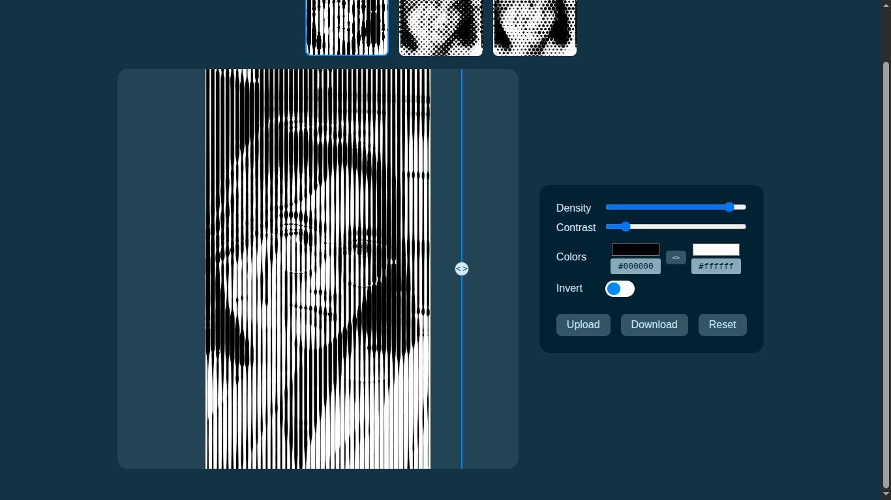
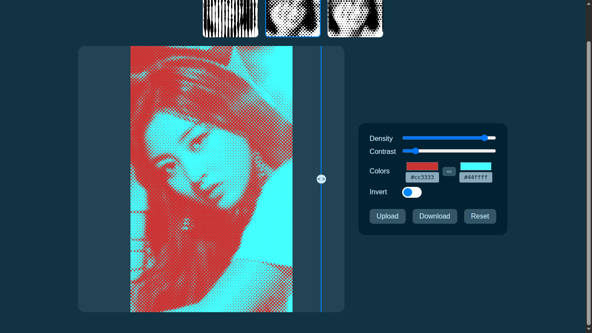
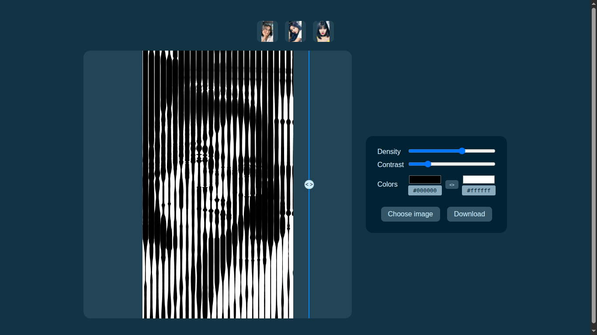

# Half-to-One

Lightweight web utility for creating and applying halftone effects to images.

## Live Demo

[Use it right away!](https://fauzan-radji.github.io/half-to-one/)

## Overview

Half-to-One is a lightweight web utility that converts images into halftone-style compositions. It provides a small client-side library and a demo web app for experimenting with color pairs, blend modes, and presets.

## Features

- Apply halftone effects entirely in the browser (no server-side processing)
- Live preview of changes
- Choose shadow and highlight colors
- Export results as image

## Demo

Open the demo in a browser, select an image, pick two colors (shadow/highlight) and tune intensity and contrast. Export the final image using the export button.

## Contributing

Contributions are welcome. Please open issues for bugs or feature requests and submit PRs against the main branch.
